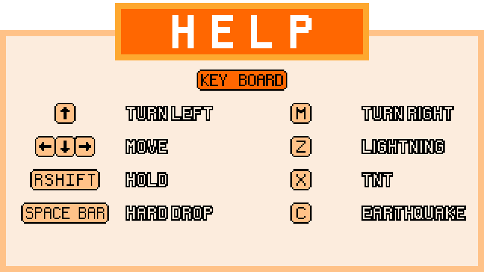
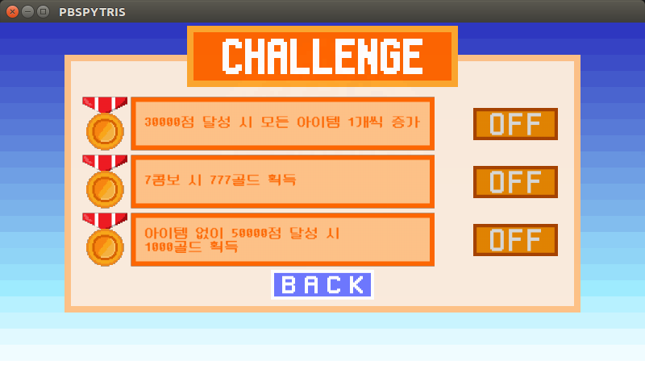

# 2021-1-OSSPC-BINSU-7
-------------

  
**Team Leader**:  Yun Sangwoo [[Awarduuu](https://github.com/Awarduuu)]   
**Team Member**: Park Shinyoung [[shxnyoung](https://github.com/shxnyoung)], Ahn Subin[[bin9841](https://github.com/bin9841)]

## How to play
### Installation (OS: Ubuntu)
1. 터미널에 `git clone https://github.com/CSID-DGU/2021-1-OSSPC-BINSU-7.git ` 입력  
(터미널 실행 경로에서 Binsu라는 이름의 폴더에 해당 프로젝트 복사)

2. 'pip install pygame' 입력  
(게임에 활용될 pygame package 설치)

3. `cd PBSPYTRIS` 입력  
(PBSPYTRIS 디렉토리로 이동)

4. `python tetrisKingdom.py` 입력   
(게임 실행)

### 조작키 안내
 

## Introduce
### 게임 소개
지난 학기 오픈소스 테트리스 프로젝트인 [Tetris-Kingdom](https://github.com/CSID-DGU/2020-2-OSSP-CP-17woljang-9)의 코드를 base code로 하여 기능을 추가하고, 오류를 보완하여 만든 게임

Single, Difficulty, Time attack, Sandbox 총 네가지 플레이모드로 구성되어 있으며, Difficulty mode와 Sandbox모드를 만드는 Gravity mode와 Attack mode가 존재한다. 

#### <구성모드>
- Gravity mode : 블록이 쌓일 때 아래가 빈칸일 시, 블록이 아래 비워진 빈칸을 채우며  
동시에 쌓인 블록이 장애물 블록으로 변하는 모드  
- Attack mode : 제한시간 (30초) 내에 콤보를 만들지 못하면 맨 밑에 장애물 블록 줄이 생성되는 모드  

#### <플레이모드>
- Single mode : 일반 테트리스 게임 모드
- Difficulty mode : easy, normal, hard 총 세가지 플레이모드가 있는 난이도 모드
  - easy mode : Attack mode on
  - normal mode : Gravity mode on
  - hard mode : Attack mode, Gravity mode on
- Time attack mode : 제한시간 60초가 주어지는 모드 
- Sandbox mode : 게임모드와 레벨을 플레이어가 조작할 수 있는 연습 모드

  
## 새로운 기능

### 상점 & 아이템

#### <상점>
gold를 소모해 item을 구매하는 창  
    
#### <아이템>
gold를 소모해 구매한 후 Difficulty mode 에서 사용 가능한 아이템   
- Lightning  
 : lightning 블록중심으로 3x3 위치의 블록 삭제  
- TNT   
 : TNT 블록을 중심으로 5x5 위치의 블록 삭제
- Earthquake  
 : 즉시 맨 아랫줄 블록 모두 삭제 및  
 score 100점 증가 

### challenge
200 gold를 소모하여 도전과제 on 가능   
 

## Score board
| Action             | Score                              |
|--------------------|------------------------------------|
| Block drop         | 10 * level                         |
| Erase 1 line       | 50 * level * 1 + combo_count       |
| Erase 2 lines      | 150 * level * 2 + 2 * combo_count  |
| Erase 3 lines      | 350 * level * 3 + 3 * combo_count  |
| Erase 4 lines      | 1000 * level * 4 + 4 * combo_count |
| Erase Rainbow line | 500 * rainbow_count                |

* combo_count: 누적 콤보 수(10초 안에 콤보 실패 시 누적 콤보 수 초기화)
* Rainbow line: 서로 다른 7가지 블록 색을 포함한 라인(장애물 제외)
* Rainbow count: 누적 레인보우 달성 횟수(초기화 X)

## Etc
[Screenshot](캡처사진 모아둔 폴더)  
[발표 자료](발표 자료 모아둔 폴더)  
협업 규칙
